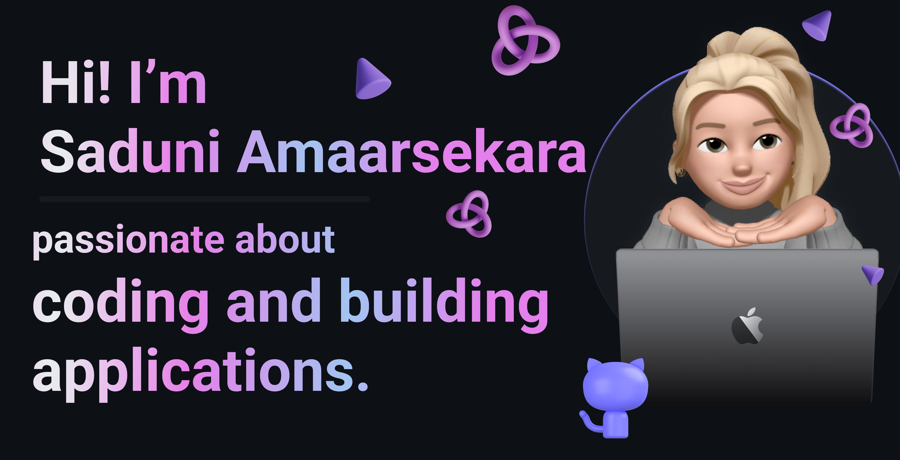

  

 Hi there, I'm Saduni Amarasekara   🚀 Fast Learner | Tinkerer | Developer | Explorer | Risk-Taker**  I'm a passionate **Software Engineering student** who thrives on turning ideas into real-world solutions. With a strong interest in **web development** and **object-oriented programming**, I enjoy building creative, functional projects—from **AI-powered tools** to **responsive web apps** that make everyday life easier and smarter 🌍💡.  🔧 I love experimenting with **new technologies**, exploring how things work, and pushing boundaries. Whether it's crafting sleek user interfaces or writing clean, efficient backend code, I'm always ready to learn and level up.  🌱 Currently diving deeper into:   - Modern web frameworks   - AI integrations   - Real-time systems   - Problem-solving through code  💡 My goal To create **tech that connects, empowers, and innovates**—one project at a time. Let's build the future together! 

## 🌐 Socials:
 

# 💻 Tech Stack:
                          
# 📊 GitHub Stats:
 
 

## 🏆 GitHub Trophies

### 🔝 Top Contributed Repo

<!-- Proudly created with GPRM ( https://gprm.itsvg.in ) -->
